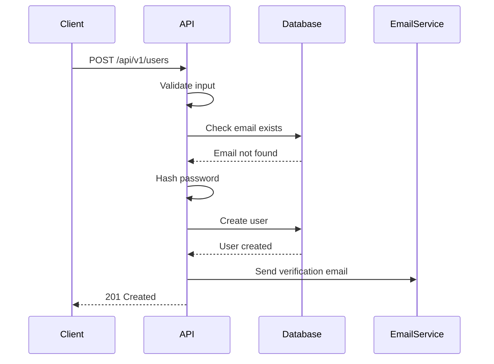

# 规范编写最佳实践

## 引言

编写高质量的规范是 SDD 成功的关键。一份好的规范应该：

- **完整** - 覆盖所有功能和边界情况
- **清晰** - 易于理解和实现
- **可测试** - 可以转化为测试用例
- **可维护** - 易于更新和版本管理

## 规范结构

### 1. 基本信息

每个规范应该包含：

```yaml
Specification: User Registration API
Version: 1.0.0
Author: Team Name
Date: 2024-01-15
Status: Draft | Review | Approved | Deprecated
```

### 2. 功能描述

清晰描述功能的目的和范围：

```yaml
Description: |
  This API allows users to register a new account.
  It validates user input and creates a user record in the database.
  
Scope:
  - User registration with email and password
  - Email validation
  - Password strength validation
  - Account creation
  
Out of Scope:
  - Email verification (handled separately)
  - Social login (handled separately)
```

### 3. API 定义

#### 请求定义

```yaml
Request:
  Method: POST
  Path: /api/v1/users
  Headers:
    Content-Type: application/json
    Accept: application/json
  Body:
    email:
      type: string
      format: email
      required: true
      description: User email address
      example: "user@example.com"
    password:
      type: string
      minLength: 8
      maxLength: 128
      required: true
      description: User password
      pattern: "^(?=.*[a-z])(?=.*[A-Z])(?=.*\\d).+$"
      example: "SecurePass123"
    name:
      type: string
      minLength: 1
      maxLength: 50
      required: false
      description: User display name
      example: "John Doe"
```

#### 响应定义

```yaml
Responses:
  Success (201 Created):
    Description: User successfully created
    Headers:
      Location: /api/v1/users/{id}
    Body:
      id:
        type: number
        description: Unique user identifier
        example: 12345
      email:
        type: string
        format: email
        example: "user@example.com"
      name:
        type: string
        example: "John Doe"
      createdAt:
        type: string
        format: date-time
        example: "2024-01-15T10:30:00Z"
  
  Error (400 Bad Request):
    Description: Invalid request data
    Body:
      message:
        type: string
        example: "Validation failed"
      errors:
        type: array
        items:
          field: string
          message: string
        example:
          - field: "email"
            message: "Invalid email format"
          - field: "password"
            message: "Password must contain uppercase, lowercase, and number"
  
  Error (409 Conflict):
    Description: Email already exists
    Body:
      message:
        type: string
        example: "Email already registered"
      code:
        type: string
        example: "EMAIL_EXISTS"
```

### 4. 边界条件

明确定义边界情况：

```yaml
Edge Cases:
  - Empty email: 400 Bad Request
  - Invalid email format: 400 Bad Request
  - Email too long (>255 chars): 400 Bad Request
  - Password too short (<8 chars): 400 Bad Request
  - Password too long (>128 chars): 400 Bad Request
  - Password without uppercase: 400 Bad Request
  - Password without lowercase: 400 Bad Request
  - Password without number: 400 Bad Request
  - Duplicate email: 409 Conflict
  - Name too long (>50 chars): 400 Bad Request
  - Special characters in name: Allowed (UTF-8)
```

### 5. 业务规则

定义业务逻辑：

```yaml
Business Rules:
  - Email must be unique across all users
  - Password must meet strength requirements
  - User account is created in "pending" state
  - Verification email is sent asynchronously
  - Account is activated after email verification
  - Failed registration attempts are logged
```

### 6. 安全要求

定义安全相关要求：

```yaml
Security:
  - Password must be hashed (bcrypt, cost factor 10)
  - Email must be validated server-side
  - Rate limiting: 5 requests per minute per IP
  - Input sanitization required
  - SQL injection prevention required
  - XSS prevention required
```

### 7. 性能要求

定义性能指标：

```yaml
Performance:
  - Response time: < 200ms (p95)
  - Database query: < 50ms
  - Concurrent users: 1000+
  - Throughput: 100 requests/second
```

## 编写技巧

### 1. 使用示例

提供清晰的示例：

```yaml
Examples:
  Success:
    Request:
      POST /api/v1/users
      {
        "email": "john@example.com",
        "password": "SecurePass123",
        "name": "John Doe"
      }
    Response:
      201 Created
      {
        "id": 12345,
        "email": "john@example.com",
        "name": "John Doe",
        "createdAt": "2024-01-15T10:30:00Z"
      }
  
  Error:
    Request:
      POST /api/v1/users
      {
        "email": "invalid-email",
        "password": "weak"
      }
    Response:
      400 Bad Request
      {
        "message": "Validation failed",
        "errors": [
          {
            "field": "email",
            "message": "Invalid email format"
          },
          {
            "field": "password",
            "message": "Password must contain uppercase, lowercase, and number"
          }
        ]
      }
```

### 2. 使用图表

对于复杂流程，使用图表：



### 3. 使用模板

建立规范模板，保持一致性：

```yaml
# API 规范模板
Specification: [API Name]
Version: [Version]
Description: [Description]

Request:
  Method: [Method]
  Path: [Path]
  # ...

Responses:
  Success: [Status]
    # ...
  Errors:
    - [Status]: [Description]
      # ...

Edge Cases:
  # ...

Business Rules:
  # ...

Security:
  # ...

Performance:
  # ...
```

## 常见错误

### 1. 规范不完整

❌ **错误**：只定义成功情况

```yaml
Response: 200 OK with user object
```

✅ **正确**：定义所有可能的情况

```yaml
Responses:
  Success (200 OK):
    # ...
  Error (404 Not Found):
    # ...
  Error (500 Internal Server Error):
    # ...
```

### 2. 边界条件遗漏

❌ **错误**：不考虑边界情况

```yaml
Request:
  id: number
```

✅ **正确**：明确定义边界

```yaml
Request:
  id:
    type: number
    minimum: 1
    maximum: 2147483647
    description: User ID must be positive integer
```

### 3. 数据类型不明确

❌ **错误**：使用模糊的类型

```yaml
date: string
```

✅ **正确**：明确格式

```yaml
date:
  type: string
  format: date-time
  pattern: "^\\d{4}-\\d{2}-\\d{2}T\\d{2}:\\d{2}:\\d{2}Z$"
  example: "2024-01-15T10:30:00Z"
```

### 4. 缺少示例

❌ **错误**：只有类型定义

```yaml
email: string
```

✅ **正确**：提供示例

```yaml
email:
  type: string
  format: email
  example: "user@example.com"
```

## 规范评审

### 评审检查清单

在提交规范评审前，检查：

- [ ] 基本信息完整（版本、作者、日期等）
- [ ] 功能描述清晰
- [ ] 请求定义完整（方法、路径、头部、体）
- [ ] 响应定义完整（成功和所有错误情况）
- [ ] 边界条件考虑全面
- [ ] 业务规则明确
- [ ] 安全要求定义
- [ ] 性能要求明确
- [ ] 提供示例
- [ ] 使用一致的格式

### 评审流程

1. **自审** - 编写者自己检查
2. **同行评审** - 团队成员评审
3. **专家评审** - 架构师或技术负责人评审
4. **批准** - 获得批准后开始实现

## 工具推荐

### 规范编写工具

- **OpenAPI/Swagger** - 最流行的 API 规范格式
- **AsyncAPI** - 异步 API 规范
- **JSON Schema** - 数据验证规范
- **Markdown** - 简单场景的文档规范

### 规范验证工具

- **Spectral** - OpenAPI 规范验证
- **Swagger Editor** - 在线编辑和验证
- **Redocly** - 规范管理和验证

## 总结

编写高质量规范的关键：

1. **结构完整** - 包含所有必要部分
2. **定义清晰** - 使用明确的类型和格式
3. **示例丰富** - 提供成功和失败的示例
4. **边界全面** - 考虑所有边界情况
5. **持续改进** - 根据反馈不断优化

在下一节中，我们将学习[团队协作](./team-collaboration.md)的最佳实践。

